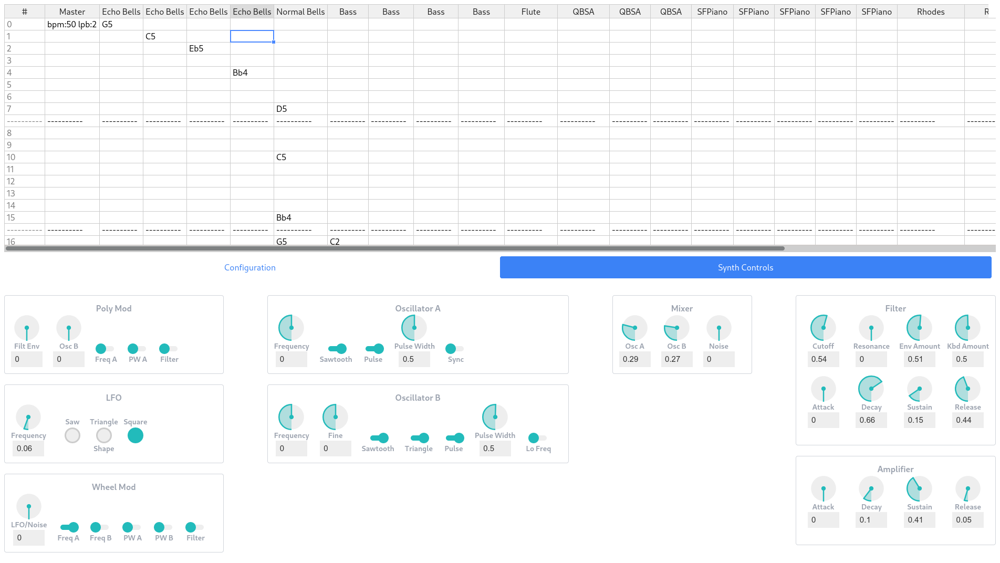

# Schisma GUI

This is a (not yet finished) PureScript rewrite of the
[GUI prototype](https://gitlab.com/schisma/gui-prototype).



# Getting Started

If you don't already have PureScript/Spago installed, please follow the steps
outlined [here](https://github.com/purescript/documentation/blob/master/guides/Getting-Started.md).

If you don't already have it, install `parcel`:

```sh
npm install -g parcel-bundler@1.12.3
```

Once those are installed, run the following:

```sh
npm install
spago build
npm run build:css
npm run copy:css
```

You'll also need to make sure [Schisma](https://gitlab.com/schisma/schisma) is
installed and available on your `$PATH`.

You can then launch a development server with the following:

```sh
npm run hot-reload:client
npm run hot-reload:server
```

The app will be running at [http://localhost:3000](http://localhost:3000).
